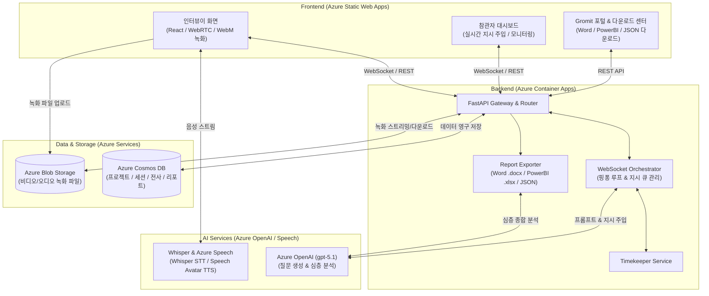

# Gromit — 3자 개입형 실시간 AI 리서치 인터뷰 플랫폼

> **인터뷰이(응답자) - AI 인터뷰어 - 참관자(리서처)** 삼자 간 실시간 상호작용 및 지시 주입(Intervention), 실시간 전사/녹화, 그리고 멀티 포맷(Word, Power BI, JSON) 종합 인사이트 리포트 자동 생성을 제공하는 엔터프라이즈 AI 리서치 솔루션입니다.

---

## 📌 프로젝트 소개 & 핵심 가치

기존의 정적인 설문이나 비대면 인터뷰의 한계를 넘어, **AI 인터뷰어가 대화를 주도하면서 백스테이지에서 인간 리서처(참관자)가 실시간으로 개입(Human-in-the-loop)**하여 인터뷰의 방향성을 동적으로 조율합니다.

1. **실시간 3자 개입 (Observer Intervention)**
   - 참관자가 실시간으로 AI에게 지시사항(`"경쟁사 대비 장점을 더 깊게 파고들어봐"`)을 주입하면, AI가 맥락에 맞춰 다음 꼬리 질문에 자연스럽게 반영합니다.
2. **반응형 AI 아바타 & 자연스러운 대화 UX**
   - 3D/인터랙티브 음성 반응 Orb 및 Web Speech / Azure Speech 기반 음성 피드백을 통해 몰입감 있는 인터뷰 경험을 제공합니다.
3. **무손실 인터뷰 녹화 & 실시간 전사**
   - 브라우저 WebRTC 미디어 스트림 기반으로 클라이언트 영상/음성을 동시 녹화(WebM)하여 Azure Blob Storage에 자동 업로드하고, 전 대화 턴(Turn)을 실시간으로 기록 및 영구 저장합니다.
4. **다차원 AI 종합 분석 & 멀티 포맷 리포트**
   - GPT-4o 기반 심층 분석: 참여자 발화 근거(Evidence) 인용, 교차 분석 핵심 발견점(Key Findings), 테마(Themes), 행동 동기(Drivers), 페인포인트(Pain Points), 니즈(Needs), 세그먼트 간 차이점(Segment Differences), 사업 기회(Opportunities), 연구 한계점(Research Gaps)을 자동 도출합니다.
   - **3종 포맷 다운로드 센터**:
     - **Word 리포트 (`.docx`)**: 시각화 표, 요약 서식이 완비된 전문 리서치 보고서
     - **Power BI 데이터셋 (`.xlsx`)**: 11개 정규화 테이블(Star Schema) 기반 즉시 시각화용 엑셀
     - **원본 분석 데이터 (`.json`)**: 원본 분석 전체 JSON 데이터
5. **역할별 맞춤형 포털**
   - **인터뷰이**: 직관적이고 몰입감 있는 1:1 화상/음성 대화 화면
   - **참관자 (PM)**: 실시간 질의응답 스트리밍, 타임키퍼, 실시간 지시 큐, AI 판단 근거(Rationale) 모니터링
   - **클라이언트**: 고객사 전용 토큰 기반 조회/다운로드 포털

---

## 🛠️ 기술 스택 (Tech Stack)

### 1. Front (프론트엔드)
- **Core**: React 19 (`web`), React 18 (`interviewee`, `dashboard`), TypeScript, Vite 6
- **Routing & State**: React Router DOM v6
- **Realtime & Media**:
  - WebSocket (양방향 실시간 이벤트 통신)
  - WebRTC / MediaStream API, MediaRecorder API (클라이언트 영상/음성 녹화)
  - Azure Communication Services Calling (`@azure/communication-calling`, `@azure/communication-react`)
  - Speech SDK (`microsoft-cognitiveservices-speech-sdk`)
- **Design & UI**:
  - Vanilla CSS (커스텀 디자인 시스템 및 반응형 다크/라이트 테마)
  - Pretendard 가변 폰트, Phosphor Icons (`@phosphor-icons/react`)
- **앱 구성**:
  - `frontend/web`: Gromit 공식 홈페이지, PM 다운로드 센터, 클라이언트 포털, 통합 대시보드
  - `frontend/interviewee`: 응답자 전용 실시간 화상/음성 인터뷰 웹앱
  - `frontend/dashboard`: 리서처 실시간 모니터링 및 3자 개입 대시보드

### 2. Back (백엔드)
- **Core Framework**: Python 3.14 / 3.11+, FastAPI (비동기 ASGI 프레임워크), Uvicorn
- **Data Validation & Settings**: Pydantic v2, Pydantic-Settings
- **실시간 통신 & 오케스트레이션**:
  - WebSocket (`websockets`, FastAPI WebSockets): 인터뷰이-AI-참관자 삼자 간 실시간 핑퐁 루프 및 지시 큐(`Instruction Management`) 오케스트레이션
  - Timekeeper: 인터뷰 시간 배분 추적, 질문 진행 제어, 종료 전 추가 지시 대기창 관리
- **문서 및 데이터 파이프라인**:
  - `python-docx`: 정교한 표/카드 서식의 Word(`.docx`) 리포트 생성
  - `xlsxwriter`: Power BI 연동용 11개 스타 스키마 테이블 다중 시트 Excel(`.xlsx`) 데이터셋 생성
  - `pypdf`, `python-multipart`: 질문 스크립트 및 인터뷰 문서 파싱
- **데이터 저장소 (Data Persistence)**:
  - Azure Cosmos DB NoSQL (`azure-cosmos`, `aiohttp`): 프로젝트, 세션 메타데이터, 전사 턴, 리포트 영구 저장 (`InterviewDB`)
  - 인메모리 폴백(`InMemoryStore`): 로컬 개발 및 테스트 시 무중단 자동 폴백
- **테스팅**: pytest, pytest-asyncio (167개 단위 및 통합 테스트)

### 3. AI (인공지능 & LLM 파이프라인)
- **대화 생성 & 오케스트레이션 (LLM)**:
  - Azure OpenAI **gpt-5.1**: 실시간 발화 맥락 이해, 참관자 지시 주입 꼬리 질문 생성, 진행 근거(Rationale) 도출, 타임키퍼 진행 제어
- **심층 리서치 분석 (Study Report Analyzer)**:
  - Azure OpenAI **gpt-5.1** 기반 멀티 세션 종합 분석기 (`StudyReportAnalyzer`)
  - 발화 근거(Evidence) 인용, 교차 분석 핵심 발견점, 페인포인트, 니즈, 세그먼트 차이점, 기회 영역 자동 추출
  - `bi_transformer`: 분석 결과를 Power BI 및 관계형 모델에 최적화된 11개 스타 스키마 테이블로 정규화
- **음성 인식 (STT)**:
  - OpenAI **Whisper** / Azure OpenAI 실시간 음성 인식
- **음성 합성 (TTS) & 실사풍 아바타**:
  - **Azure Speech Services (TTS / TTS Avatar)**: 실사풍 아바타(Lisa) 영상 스트리밍 및 음성 합성 (※ Speech STT는 미사용)
  - 인터뷰이 화면 반응형 음성 애니메이션 Orb (Speaking / Listening / Idle)

### 4. Azure (클라우드 인프라 & DevOps)
- **컴퓨트 & 호스팅**:
  - **Azure Container Apps (ACA)**: 백엔드 FastAPI 서버를 도커 컨테이너로 서버리스 호스팅, 자동 스케일링, 인그레스(Ingress) 설정
  - **Azure Static Web Apps (SWA)**:
    - SWA 1 (`orange-sand`): 인터뷰이 웹 (`frontend/interviewee`)
    - SWA 2 (`victorious-pond`): Gromit 공식 웹 & 통합 대시보드 (`frontend/web`)
  - **Azure Container Registry (ACR)**: 백엔드 도커 이미지 프라이빗 빌드/저장소 (`team2container`)
- **데이터베이스 & 스토리지**:
  - **Azure Cosmos DB (NoSQL)**: 연구 프로젝트, 세션, 인터뷰 전사본, 종합 리포트 JSON 저장 (`InterviewDB`)
  - **Azure Blob Storage**: 인터뷰이 비디오/오디오 녹화 파일(`.webm`), 첨부 파일 영구 저장 (`recordings` 컨테이너)
- **통신 & AI 서비스**:
  - **Azure OpenAI Service**: `gpt-5.1`, Whisper
  - **Azure Speech Services**: TTS 및 실사풍 아바타 스트리밍 전용 (STT 미사용)
  - **Azure Communication Services (ACS)**: WebRTC 미디어 채널 자격 증명 관리
- **CI/CD 파이프라인**:
  - **GitHub Actions**:
    - `deploy-backend.yml`: Azure OIDC 로그인 ➜ ACR 이미지 원격 빌드 ➜ Container Apps 무중단 배포
    - `azure-static-web-apps-*.yml`: 프론트엔드 변경 시 Static Web Apps 자동 빌드 및 배포

---

## 🏗️ 시스템 아키텍처



---

## 📂 디렉토리 구조

```
.
├── .github/workflows/
│   ├── deploy-backend.yml                         # 백엔드 ACR 빌드 & Container Apps 배포
│   ├── azure-static-web-apps-orange-sand-*.yml    # 인터뷰이 웹 SWA 배포
│   └── azure-static-web-apps-victorious-pond-*.yml # 통합 웹 & 대시보드 SWA 배포
├── backend/
│   ├── Dockerfile
│   ├── requirements.txt
│   ├── app/
│   │   ├── main.py                                # FastAPI 앱 엔트리포인트 및 라우터 마운트
│   │   ├── core/config.py                         # Pydantic Settings 환경 설정
│   │   ├── api/
│   │   │   ├── routes/                            # /projects, /sessions, /downloads, /client
│   │   │   ├── ws/                                # /ws/interview/{id}, /ws/observer/{id}
│   │   │   └── download_responses.py              # 다중 포맷 다운로드 응답 빌더
│   │   ├── schemas/                               # Study, Session, Report, WebSocket 스키마
│   │   ├── services/
│   │   │   ├── orchestrator.py                    # 실시간 인터뷰 대화 핑퐁 루프
│   │   │   ├── connections.py                     # WebSocket 연결 세션 레지스트리
│   │   │   ├── project_report.py                  # 종합 리포트 생성 및 백그라운드 태스크
│   │   │   ├── downloads.py                       # Word / PowerBI / JSON 문서 빌더
│   │   │   ├── storage.py / recordings.py         # Azure Blob Storage 녹화본 관리
│   │   │   ├── store.py / cosmos_store.py         # Cosmos DB 및 인메모리 저장소
│   │   │   └── ai/                                # LLM, STT, TTS, Timekeeper
│   │   └── export_study_report_bi.py              # Power BI 11개 테이블 정규화 엑셀 익스포터
│   └── tests/                                     # 167개 단위 및 통합 테스트
├── frontend/
│   ├── web/                                       # Gromit 공식 웹, 다운로드 센터, 고객 포털
│   ├── interviewee/                               # 응답자 실시간 음성/영상 인터뷰 웹앱
│   └── dashboard/                                 # 리서처 참관 및 실시간 개입 대시보드
├── infra/
│   ├── architecture.png                           # 시스템 아키텍처 다이어그램
│   └── azure-setup.sh                             # Azure 인프라 리소스 프로비저닝 스크립트
└── docs/
    └── azure-setup.md                             # Azure 리소스 구성 및 설정 가이드
```

---

## 🚀 로컬 개발 및 실행 방법

### 1. 백엔드 실행

```bash
cd backend
python -m venv .venv
# Windows:
.venv\Scripts\activate
# macOS/Linux:
# source .venv/bin/activate

pip install -r requirements.txt
cp .env.example .env     # 환경변수 설정 (Azure OpenAI, Cosmos DB 등 연결)

# 서버 실행 (포트 8000)
uvicorn app.main:app --reload --port 8000
```
- Swagger API 문서: `http://localhost:8000/docs`
- 헬스 체크: `http://localhost:8000/health`
- 전체 테스트 실행: `pytest`

### 2. 프론트엔드 실행

```bash
# 1) Gromit 메인 웹 & 다운로드 센터 & 클라이언트 포털 (기본 포트: 5175)
cd frontend/web
npm install
npm run dev

# 2) 응답자 인터뷰이 웹앱 (기본 포트: 5173)
cd frontend/interviewee
npm install
npm run dev

# 3) 참관자 실시간 대시보드 (기본 포트: 5174)
cd frontend/dashboard
npm install
npm run dev
```

---

## 💡 주요 인터뷰 워크플로우

1. **프로젝트 & 질문 스크립트 등록**
   - 리서처가 웹 포털에서 조사 목적과 질문 스크립트를 입력하여 프로젝트를 생성합니다.
2. **세션 생성 및 인터뷰이 링크 발급**
   - 인터뷰 세션을 생성하면 응답자 전용 접속 링크가 발급됩니다.
3. **실시간 화상/음성 인터뷰 진행**
   - 인터뷰이가 접속하면 웹캠/마이크가 활성화되고 AI 인터뷰어가 오프닝 인사 및 질문을 진행합니다.
   - 응답자 측 브라우저에서 비디오/오디오가 실시간으로 녹화(WebM)됩니다.
4. **참관자 실시간 개입 (Observer Intervention)**
   - 리서처는 대시보드에서 응답자의 답변을 실시간으로 모니터링하며, 심화 질의가 필요할 때 지시사항을 입력합니다.
   - 지시사항은 큐(`queued`)에 들어가고, AI가 다음 턴 질문 생성 시 이를 반영하여 질문(`applied`)합니다.
5. **인터뷰 종료 & 녹화본 자동 업로드**
   - 인터뷰가 종료되면 녹화 파일이 Azure Blob Storage(`recordings`)로 자동 업로드됩니다.
6. **AI 종합 리포트 생성 & 멀티 포맷 다운로드**
   - 완료된 인터뷰 세션들을 기반으로 AI 종합 리포트를 생성합니다.
   - 다운로드 센터에서 **Word 리포트(`.docx`)**, **Power BI 분석 엑셀(`.xlsx`)**, **원본 데이터(`.json`)**를 즉시 다운로드할 수 있습니다.
